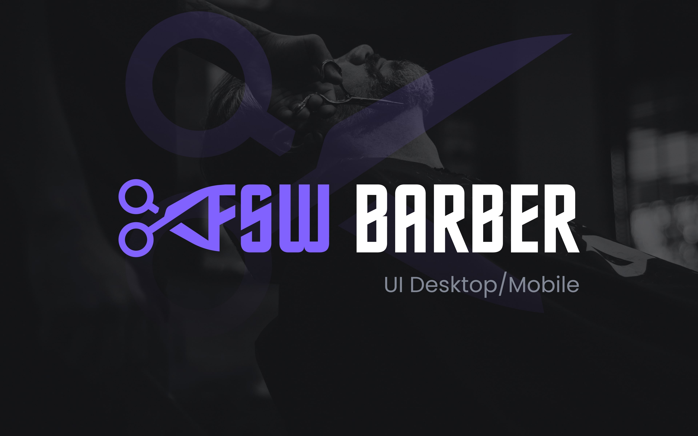

<h1 align="center">
  <br>
    
  <br>
  FSW Barber
  <br>
</h1>

<h4 align="center">
    An application for scheduling services in barbershops
</h4>

<p align="center">
  <a href="#about">About</a> •
  <a href="#key-features">Key Features</a> •
  <a href="#languages-and-technologies">Languages and technologies</a> •
  <a href="#prerequisites">Prerequisites</a> •
  <a href="#how-to-use">How To Use</a> •
  <a href="#contact">Contact</a> •
</p>

<div align="center">

[](https://fsw-barber-omega.vercel.app/)
</div>


<div align="center" style="width: 100%">

</div>

## About
This was a simple application inspired by the full stack week event taught by instructor [Felipe Rocha](https://www.linkedin.com/in/felipe-rocha-034871172/), but with some improvements completely developed for me. The most hard step was adapte the layout for desktop, requiring a lot of organization in the structuring of components.

## Key Features

- OAuth Login By Google
- List all available barbershops
- The user can make a booking with date and time
- The user can list all their bookings
- The user can cancel a booking

## Languages and technologies
Front-end: 


Devops: 
## Prerequisites

To run the project on your machine, you must have <a href="https://nodejs.org/en">Node.js</a> installed, preferably both in their latest stable version.

## How To Use

### Clone this repository
```bash
# Clone this repository
$ git clone git@github.com:joseuilton/myscret.git

# Go into the repository
$ cd myscret
```

### Configure and run the application

add a ".env" file with database's configuration, google client id and next auth secret, follow the structure of ".env.sample"

```bash
# Install all dependencies
$ npm install

# Run all migrations
$ npx prisma migrate dev

# Run API
$ npm run dev
```
## Contact
José Uilton - [@joseuilton](https://www.linkedin.com/in/joseuilton/) - joseuilton.siqueira@gmail.com

---
Made with :purple-heart: by José Uilton
